# Neural Network Architectures — Code-Focused Field Guide (PyTorch + Diagrams)

A practical, code-oriented overview of key architectures: what they are, when to use them, with minimal PyTorch examples.

---

## 0) Quick “when to use what”

| Modality / Task         | First pick                 | Why                          | Alternatives           |
| ----------------------- | -------------------------- | ---------------------------- | ---------------------- |
| Tabular (CTR/ranking)   | Wide & Deep / DLRM         | sparse IDs + dense feats     | Plain MLP              |
| Images (classification) | ResNet / ViT (pretrained)  | strong transfer              | ConvNeXt, EfficientNet |
| Images (segmentation)   | U-Net / DeepLab            | multi-scale + skips          | FPN, Mask R-CNN        |
| Text understanding      | Encoder Transformer (BERT) | contextual reps              | BiLSTM+CRF (small)     |
| Text/code generation    | Decoder Transformer (GPT)  | SOTA generation              | RNN-LM (on-device)     |
| Seq2Seq (translation)   | Encoder–Decoder (T5/BART)  | alignment via attention      | CTC+attention hybrids  |
| Time series             | TCN / Transformer          | long horizon receptive field | S4/SSM, classical      |
| Speech (streaming ASR)  | RNN-T / Conformer          | streaming + accuracy         | CTC + chunking         |
| Graphs                  | GCN/GAT/GraphSAGE          | exploits edges               | Graph Transformers     |
| Retrieval/verification  | Siamese/contrastive        | metric space                 | Triplet, ArcFace       |
| Generative (images)     | Diffusion (Latent)         | fidelity + stability         | GANs, autoreg.         |

---

# 1) MLP (Multi-Layer Perceptron)

**Use:** tabular, small dense features, heads on top of encoders.

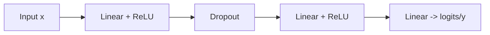

```python
import torch, torch.nn as nn

class MLP(nn.Module):
	def __init__(self, d_in, d_hidden=256, d_out=1, p=0.1):
		super().__init__()
		self.net = nn.Sequential(
			nn.Linear(d_in, d_hidden),
			nn.ReLU(),
			nn.Dropout(p),
			nn.Linear(d_hidden, d_hidden),
			nn.ReLU(),
			nn.Linear(d_hidden, d_out)
		)
	def forward(self, x):
		return self.net(x)

# Tip: standardize features, use weight decay, early stop for tabular.
```

**When:** lots of dense engineered features or embeddings; otherwise CNN/Transformer often wins.

---

# 2) CNNs (ResNet-style)

**Use:** images (and 2D/1D signals). Translation equivariance, local filters.

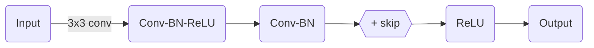

```python
class BasicBlock(nn.Module):
	def __init__(self, c, stride=1):
		super().__init__()
		self.conv1 = nn.Conv2d(c, c, 3, stride, 1, bias=False)
		self.bn1 = nn.BatchNorm2d(c)
		self.conv2 = nn.Conv2d(c, c, 3, 1, 1, bias=False)
		self.bn2 = nn.BatchNorm2d(c)

	def forward(self, x):
		identity = x
		out = torch.relu(self.bn1(self.conv1(x)))
		out = self.bn2(self.conv2(out))
		out += identity
		return torch.relu(out)

class TinyResNet(nn.Module):
	def __init__(self, in_ch=3, num_classes=10):
		super().__init__()
		self.stem = nn.Sequential(
			nn.Conv2d(in_ch, 64, 7, 2, 3, bias=False),
			nn.BatchNorm2d(64),
			nn.ReLU(),
			nn.MaxPool2d(3,2,1))
		self.layer = nn.Sequential(*[BasicBlock(64) for _ in range(4)])
		self.head = nn.Linear(64, num_classes)

	def forward(self, x):
		x = self.stem(x)
		x = self.layer(x).mean(dim=(2,3))  # global avg pool
		return self.head(x)
```

**Tips:** transfer-learn from ResNet-50 (freeze most layers; train head), use augmentations (mixup, CutMix), cosine LR with warmup.

---

# 3) U-Net (Encoder–Decoder with skips)

**Use:** segmentation, denoising, image-to-image.

```
Encoder: conv ↓ ↓ ↓
            ↘    ↘
Skips  ───────────┐
Decoder:      ↑ ↑ ↑ with concat
```

```python
class ConvBlock(nn.Module):
	def __init__(self, c_in, c_out):
		super().__init__()
		self.block = nn.Sequential(
			nn.Conv2d(c_in, c_out, 3, padding=1), nn.ReLU(),
			nn.Conv2d(c_out, c_out, 3, padding=1), nn.ReLU())
	def forward(self, x): return self.block(x)

class UNet(nn.Module):
	def __init__(self, in_ch=1, out_ch=1, base=32):
		super().__init__()
		self.down1 = ConvBlock(in_ch, base)
		self.down2 = ConvBlock(base, base*2)
		self.down3 = ConvBlock(base*2, base*4)
		self.pool = nn.MaxPool2d(2)

		self.bottleneck = ConvBlock(base*4, base*8)

		self.up3 = nn.ConvTranspose2d(base*8, base*4, 2, 2)
		self.dec3 = ConvBlock(base*8, base*4)
		self.up2 = nn.ConvTranspose2d(base*4, base*2, 2, 2)
		self.dec2 = ConvBlock(base*4, base*2)
		self.up1 = nn.ConvTranspose2d(base*2, base, 2, 2)
		self.dec1 = ConvBlock(base*2, base)

		self.out = nn.Conv2d(base, out_ch, 1)

	def forward(self, x):
		s1 = self.down1(x); x = self.pool(s1)
		s2 = self.down2(x); x = self.pool(s2)
		s3 = self.down3(x); x = self.pool(s3)
		x = self.bottleneck(x)
		x = self.up3(x); x = torch.cat([x, s3], dim=1); x = self.dec3(x)
		x = self.up2(x); x = torch.cat([x, s2], dim=1); x = self.dec2(x)
		x = self.up1(x); x = torch.cat([x, s1], dim=1); x = self.dec1(x)
		return self.out(x)
```

**Tips:** use Dice/Focal loss with class imbalance; deep supervision helps.

---

# 4) RNNs (Vanilla / LSTM / GRU)

**Use:** streaming/online sequence modeling, low latency.

**Diagram A**
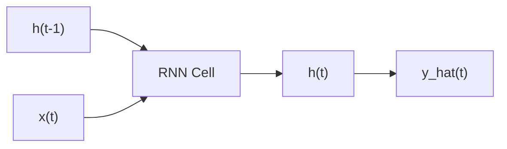

**Diagram B**
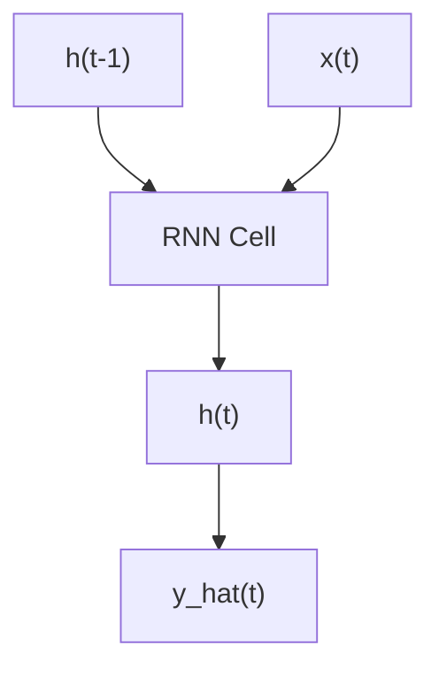

```python
class TinyRNN(nn.Module):
	def __init__(self, d_in, d_hid, d_out):
		super().__init__()
		self.rnn = nn.GRU(d_in, d_hid, batch_first=True)  # or nn.LSTM
		self.head = nn.Linear(d_hid, d_out)
	def forward(self, x, h0=None):
		# x: (B, T, d_in)
		h, _ = self.rnn(x, h0)
		logits = self.head(h)       # (B, T, d_out)
		return logits
```

**Tips:** orthogonal init for recurrent weights; gradient clipping; use LSTM/GRU over vanilla; RNN-T for streaming ASR.

---

# 5) Temporal Convolutional Networks (TCN)

**Use:** time series forecasting/classification with long receptive fields.

**Diagram A**
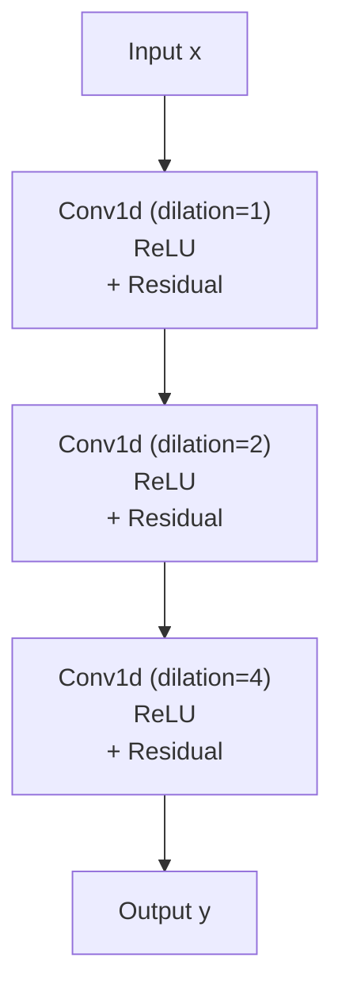

**Diagram B**
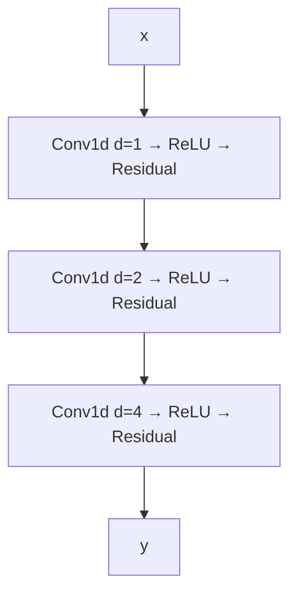

**Diagram C**
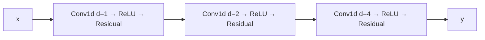

```python
class TCNBlock(nn.Module):
	def __init__(self, c, k=3, dilation=1, p=0.1):
		super().__init__()
		self.net = nn.Sequential(
			nn.Conv1d(c, c, k, padding=dilation*(k-1)//2, dilation=dilation),
			nn.ReLU(),
			nn.Dropout(p),
			nn.Conv1d(c, c, k, padding=dilation*(k-1)//2, dilation=dilation))
	def forward(self, x):
		return torch.relu(self.net(x) + x)

class TinyTCN(nn.Module):
	def __init__(self, d_in, d_hid, d_out):
		super().__init__()
		self.proj = nn.Conv1d(d_in, d_hid, 1)
		self.blocks = nn.Sequential(
			TCNBlock(d_hid, dilation=1),
			TCNBlock(d_hid, dilation=2),
			TCNBlock(d_hid, dilation=4))
		self.head = nn.Conv1d(d_hid, d_out, 1)
	def forward(self, x):  # x: (B, T, d_in)
		x = x.transpose(1,2)
		x = self.proj(x)
		x = self.blocks(x)
		return self.head(x).transpose(1,2)  # (B,T,d_out)
```

---

# 6) Transformers (Encoder / Decoder / Enc-Dec)

**Use:** text/code, long-range dependencies, scalable transfer.

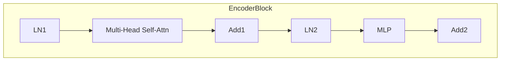

```python
class MHSA(nn.Module):
	def __init__(self, d_model, n_heads):
		super().__init__()
		assert d_model % n_heads == 0
		self.nh = n_heads; self.dk = d_model // n_heads
		self.qkv = nn.Linear(d_model, 3*d_model)
		self.proj = nn.Linear(d_model, d_model)

	def forward(self, x, mask=None):
		B,T,D = x.shape
		q,k,v = self.qkv(x).chunk(3, dim=-1)  # (B,T,D) each
		def split(t): return t.view(B,T,self.nh,self.dk).transpose(1,2) # (B,nh,T,dk)
		q,k,v = map(split, (q,k,v))
		scores = (q @ k.transpose(-2,-1)) / (self.dk**0.5)  # (B,nh,T,T)
		if mask is not None: scores = scores.masked_fill(mask==0, -1e9)
		w = scores.softmax(dim=-1)
		attn = w @ v                                  # (B,nh,T,dk)
		attn = attn.transpose(1,2).contiguous().view(B,T,D)
		return self.proj(attn)

class TransformerBlock(nn.Module):
	def __init__(self, d_model=512, n_heads=8, d_ff=2048, p=0.1):
		super().__init__()
		self.ln1 = nn.LayerNorm(d_model)
		self.attn = MHSA(d_model, n_heads)
		self.ln2 = nn.LayerNorm(d_model)
		self.ff = nn.Sequential(
			nn.Linear(d_model, d_ff), nn.ReLU(), nn.Dropout(p),
			nn.Linear(d_ff, d_model))
	def forward(self, x, mask=None):
		x = x + self.attn(self.ln1(x), mask)
		x = x + self.ff(self.ln2(x))
		return x
```

**Tips:** use pretrained checkpoints; for long sequences consider efficient attention (Performer/Longformer) or SSMs; tune LR with warmup + cosine; apply weight decay to weights (exclude LayerNorm/bias).

---

# 7) Graph Neural Networks (GCN/GAT)

**Use:** data with nodes + edges (molecules, social nets, KGs).

**Diagram A**
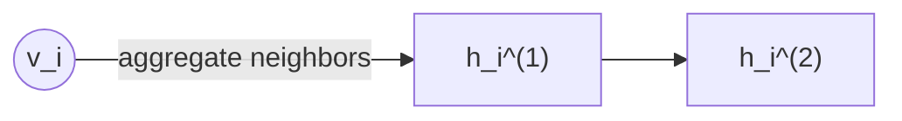

**Diagram B**
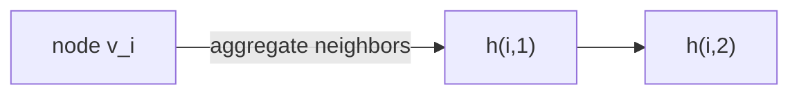

**Diagram C**
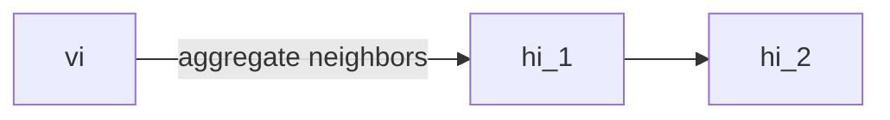

> **GCN layer (message passing):** (H^{(l+1)} = \sigma(\hat{D}^{-1/2}\hat{A}\hat{D}^{-1/2} H^{(l)} W^{(l)}))

```python
class GCNLayer(nn.Module):
	def __init__(self, d_in, d_out):
		super().__init__()
		self.lin = nn.Linear(d_in, d_out, bias=False)

	def forward(self, X, A_hat):  # X: (N,d), A_hat: normalized adj (N,N)
		return torch.relu(A_hat @ self.lin(X))

# Minimal forward:
# A_hat = add_self_loops_and_normalize(A)  # precompute once
# X -> GCNLayer -> GCNLayer -> readout (mean/sum pooling) -> MLP
```

**Tips:** sample neighborhoods on large graphs; add residuals & norms; handle class imbalance with weighted loss.

---

# 8) Siamese / Contrastive (Metric Learning)

**Use:** retrieval, verification, deduplication (face/voice), CLIP-style.

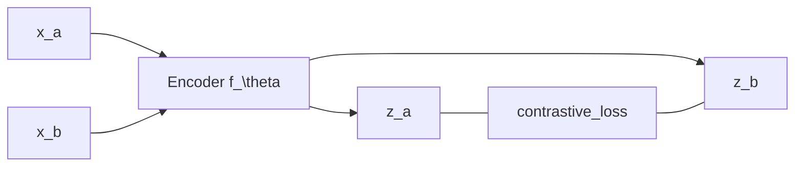

```python
class Encoder(nn.Module):
	def __init__(self, d_in, d_emb=128):
		super().__init__()
		self.net = nn.Sequential(nn.Linear(d_in, 256), nn.ReLU(), nn.Linear(256, d_emb))
	def forward(self, x): return nn.functional.normalize(self.net(x), dim=-1)

def contrastive_loss(z_a, z_b, tau=0.1):
	sim = z_a @ z_b.t() / tau                       # (B,B)
	target = torch.arange(z_a.size(0), device=z_a.device)
	return nn.CrossEntropyLoss()(sim, target)       # InfoNCE (a->b); often add b->a
```

**Tips:** batch composition matters (hard negatives); use temperature; consider margin losses (ArcFace) for classification-as-metric.

---

# 9) Recommenders (Wide & Deep)

**Use:** sparse categorical IDs + dense numerical features.

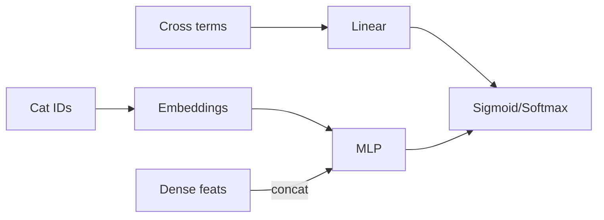

```python
class WideAndDeep(nn.Module):
	def __init__(self, num_ids, emb_dim, d_dense, d_hidden=256):
		super().__init__()
		self.emb = nn.Embedding(num_ids, emb_dim)
		self.deep = nn.Sequential(
			nn.Linear(emb_dim + d_dense, d_hidden), nn.ReLU(),
			nn.Linear(d_hidden, d_hidden), nn.ReLU())
		self.wide = nn.Linear(d_dense, 1)   # example: linear over dense (add crosses externally)
		self.out = nn.Linear(d_hidden, 1)

	def forward(self, ids, dense):
		e = self.emb(ids).mean(dim=1)       # bag multiple IDs: (B, M, emb) -> (B, emb)
		deep_out = self.deep(torch.cat([e, dense], dim=-1))
		logit = self.wide(dense) + self.out(deep_out)
		return torch.sigmoid(logit).squeeze(-1)
```

**Tips:** embeddings dominate memory → consider quantization/sharding; calibrate outputs (Platt/temperature).

---

# 10) Diffusion (DDPM — toy skeleton)

**Use:** high-fidelity generation (images/audio). Below is a minimal 1D sketch.

```python
class TinyUNet1D(nn.Module):
	def __init__(self, d=64):
		super().__init__()
		self.net = nn.Sequential(
			nn.Linear(1, d), nn.SiLU(),
			nn.Linear(d, d), nn.SiLU(),
			nn.Linear(d, 1))
	def forward(self, x, t_emb):  # t_emb ignored here; real models condition on t
		return self.net(x)

# Training loop idea (toy):
# sample t ~ Uniform({1..T}); add noise ε to x0 to get xt; predict ε
# loss = ||ε - ε_theta(xt, t)||^2
```

**Tips:** use sinusoidal time embeddings, U-Net backbones, cosine noise schedules; classifier-free guidance for conditional tasks; latent diffusion for speed.

---

# 11) Normalizing Flows (RealNVP-style affine coupling)

**Use:** exact likelihood + sampling.

```python
class AffineCoupling(nn.Module):
	def __init__(self, d):
		super().__init__()
		self.s = nn.Sequential(nn.Linear(d//2, d), nn.ReLU(), nn.Linear(d, d//2))
		self.t = nn.Sequential(nn.Linear(d//2, d), nn.ReLU(), nn.Linear(d, d//2))
	def forward(self, x, reverse=False):
		x1, x2 = x.chunk(2, dim=-1)
		s, t = self.s(x1), self.t(x1)
		if not reverse:
			y2 = x2 * torch.exp(s) + t
			logdet = s.sum(dim=-1)
		else:
			y2 = (x2 - t) * torch.exp(-s)
			logdet = -s.sum(dim=-1)
		return torch.cat([x1, y2], dim=-1), logdet
```

**Tips:** stack many couplings + permutations; track log-det sums; careful init to stabilize training.

---

# 12) State-Space / Long-Sequence (S4-style intuition)

**Use:** very long sequences with sub-quadratic cost.

*Idea:* learn a linear time-invariant system ( x_{t+1}=Ax_t+Bu_t,\ y_t=Cx_t+Du_t ) discretized and convolved efficiently.

```python
# Toy stand-in: depthwise 1D conv with long kernels (a crude SSM proxy)
class LongConv(nn.Module):
	def __init__(self, d_model, k=1024):
		super().__init__()
		self.dw = nn.Conv1d(d_model, d_model, k, groups=d_model, padding=k-1)
		self.ln = nn.LayerNorm(d_model)
	def forward(self, x):                   # x: (B,T,D)
		y = self.dw(x.transpose(1,2)).transpose(1,2)
		return self.ln(x + y)
```

**Tips:** if you need 10k+ context lengths with reasonable memory, try S4/Hyena; combine with attention for hybrid models.

---

# 13) Training patterns that generalize

```python
def configure_optimizers(model, lr=3e-4, wd=0.01):
	# AdamW, exclude norms/bias from decay
	decay, no_decay = [], []
	for n, p in model.named_parameters():
		if not p.requires_grad: continue
		if p.ndim >= 2: decay.append(p)      # weights
		else: no_decay.append(p)             # bias, LayerNorm, etc.
	return torch.optim.AdamW([
		{'params': decay, 'weight_decay': wd},
		{'params': no_decay, 'weight_decay': 0.0}], lr=lr)

def cosine_schedule(optimizer, warmup_steps, total_steps):
	def lr_lambda(step):
		if step < warmup_steps:
			return step / max(1, warmup_steps)
		progress = (step - warmup_steps) / max(1, total_steps - warmup_steps)
		return 0.5 * (1.0 + torch.cos(torch.pi * progress))
	return torch.optim.lr_scheduler.LambdaLR(optimizer, lr_lambda)
```

**Other tips**

* Initialize: Xavier for `tanh`, He/Kaiming for ReLU; orthogonal recurrent matrices.
* Regularize: dropout, data augmentation, label smoothing, early stopping.
* Stabilize: gradient clipping for RNN/Transformer; mixed precision (AMP); gradient accumulation.

---

# 14) Evaluation & selection checklist

1. **Data shape & scale:** images vs text vs graphs; label count; class imbalance.
2. **Context length / latency:** streaming? on-device? pick RNN/TCN/efficient attention when needed.
3. **Inductive bias:** do you have spatial/temporal/graph structure? choose CNN/TCN/GNN.
4. **Compute budget:** pretrained encoders and adapters (LoRA) save time & energy.
5. **Metrics:** accuracy vs F1 vs AUROC vs calibration; latency/throughput in deployment.

---

# 15) Minimal training loop template (classification)

```python
def train_epoch(model, loader, optimizer, scheduler=None, clip=1.0, device="cuda"):
	model.train(); total=correct=0
	criterion = nn.CrossEntropyLoss()
	for x, y in loader:
		x, y = x.to(device), y.to(device)
		optimizer.zero_grad(set_to_none=True)
		logits = model(x)
		loss = criterion(logits, y)
		loss.backward()
		nn.utils.clip_grad_norm_(model.parameters(), clip)
		optimizer.step()
		if scheduler: scheduler.step()
		total += y.size(0); correct += (logits.argmax(1)==y).sum().item()
	return correct/total
```

---

# 16) Common “gotchas”

* **Overfit on tabular:** trees often beat MLPs unless you have large data + embeddings.
* **BatchNorm with tiny batches:** switch to GroupNorm/LayerNorm for stability.
* **Weight decay on norms/biases:** usually exclude (see optimizer config above).
* **Class imbalance:** use weighted loss, focal loss, or resampling.
* **Sequence padding:** use masks in attention; avoid learning from padding tokens.

---

# 17) Where to go deeper (topics to search/study next)

* **Vision:** ResNet, ConvNeXt, ViT, Swin, UNet, DETR.
* **NLP:** BERT, T5, GPT; LoRA/adapters; instruction tuning; retrieval-augmented gen.
* **Audio/Speech:** Conformer, wav2vec 2.0, HuBERT, RNN-T.
* **Graphs:** GCN, GAT, GraphSAGE, Graph Transformer; positional encodings.
* **Generative:** VAE, GAN, Flows, Diffusion; classifier-free guidance; latent diffusion.
* **Long-context:** Performer, Longformer, S4/Hyena; memory modules.

---

## Appendix: tiny “starter” datasets & shapes

* **Images:** (B,3,H,W) → CNN/ViT; normalize to ImageNet stats for transfer.
* **Text:** token ids (B,T) → embedding + Transformer; pad + attention mask.
* **Time series:** (B,T,features) → TCN/RNN; z-score per feature.
* **Graphs:** node features (N,d), edges (E×2) → GNN; build normalized adjacency.
* **Tabular:** dense (B,d) + sparse IDs (B,M) → embeddings + MLP head.

---
