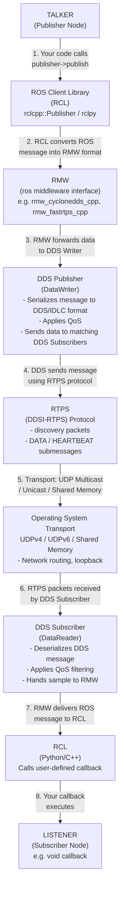

# **ROS 2 Communication Flow: Talker → Listener**

This document explains and visualizes how a message travels from a **publisher node (talker)** to a **subscriber node (listener)** in ROS 2. It breaks down each layer involved—from the user-facing ROS APIs all the way down to DDS, RTPS, and the OS network transport.

The goal is to clarify the roles of:

* **RCL** (ROS Client Libraries: rclcpp / rclpy)
* **RMW** (ROS Middleware Interface)
* **DDS** (Data Distribution Service implementations like Fast DDS, Cyclone DDS)
* **RTPS** (Real-Time Publish-Subscribe protocol)
* **Transport** (UDP, multicast, shared memory)

This layered architecture is what makes ROS 2 middleware-agnostic and allows nodes to communicate transparently, regardless of which DDS implementation is selected.

---

# **End-to-End Diagram: Talker → Listener**

