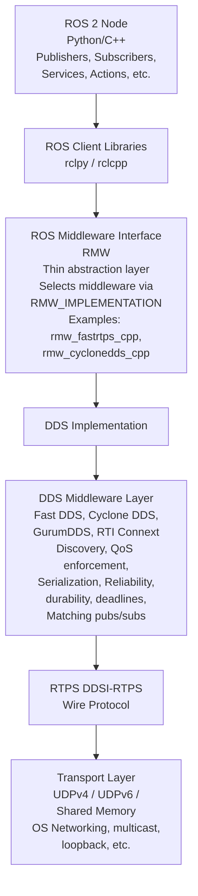

# **1. Diagram — ROS 2 Communication Stack (Text-based / Markdown)**

```mermaid
flowchart TD
    A["ROS 2 Node<br/>Python/C++<br/>Publishers, Subscribers,<br/>Services, Actions, etc."]
    B["ROS Client Libraries<br/>rclpy / rclcpp"]
    C["ROS Middleware Interface<br/>RMW<br/>Thin abstraction layer<br/>Selects middleware via<br/>RMW_IMPLEMENTATION<br/>Examples: rmw_fastrtps_cpp,<br/>rmw_cyclonedds_cpp"]
    D["DDS Implementation"]
    E["DDS Middleware Layer<br/>Fast DDS, Cyclone DDS,<br/>GurumDDS, RTI Connext<br/>Discovery, QoS enforcement,<br/>Serialization, Reliability,<br/>durability, deadlines,<br/>Matching pubs/subs"]
    F["RTPS DDSI-RTPS<br/>Wire Protocol"]
    G["Transport Layer<br/>UDPv4 / UDPv6 /<br/>Shared Memory<br/>OS Networking, multicast,<br/>loopback, etc."]
    A --> B
    B --> C
    C --> D
    D --> E
    E --> F
    F --> G
```

This shows how a ROS node uses RCL → RMW → DDS → RTPS → Transport to communicate.

---
